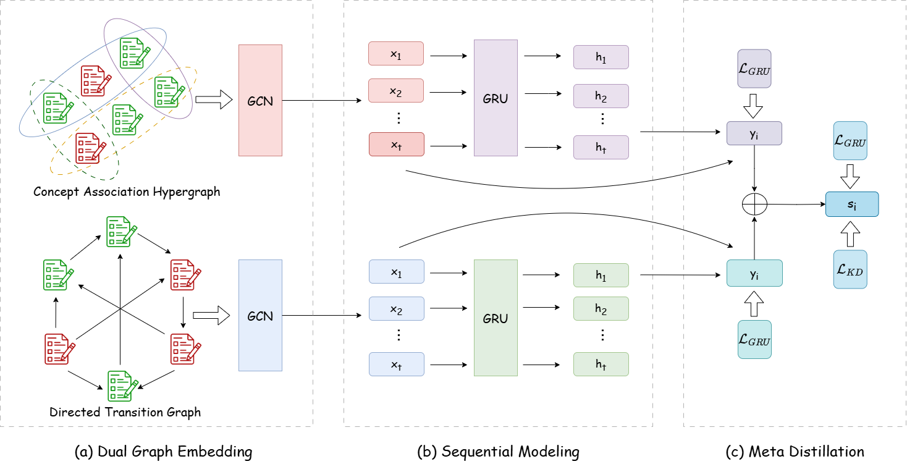

# AMBER

This is the official  implementation for the paper *"AMBER: Adaptive Meta-Balancing for Integrating Heterogeneous Graphs in
Knowledge Tracing"*

## Overview



We propose **AMBER** (Adaptive Meta-Balanced Ensemble Representation learning), a novel framework for balanced multi-graph KT. AMBER consists of two key components:

(1) a meta-distillation mechanism that distills ensemble knowledge from a pretrained dual-graph teacher model while dynamically adjusting the teacher based on feedback from the student’s performance. This mitigates structural bias and improves the quality of knowledge transfer;

(2) an adaptive graph rebalancing strategy that formulates KT as a multi-task learning problem over different graph branches and their ensemble fusion, and dynamically adjusts gradient contributions from each branch during training to promote optimization balance.

By promoting balanced opti-
mization across graphs, AMBER enables more effective integration of heterogeneous learning signals in KT, providing a robust and scalable solution for personalized education.

## Dataset

We evaluate our method on three benchmark datasets for knowledge tracing, i.e., ASSIST09, ASSIST17, and EdNet.

## Requirements

```plaintext
torch==2.4.1
tqdm==4.67.1
numpy==1.21.2
scipy==1.7.3
scikit-learn==1.0.2
geomloss==0.2.6

```

## Train

To train the teacher model:

```python
python run_tkt.py

```

To train AMBER:

```python
python run_mns.py
```

## Test

comment out `KTtrain` in `run_mns.py` and

```python
python run_mns.py
```
